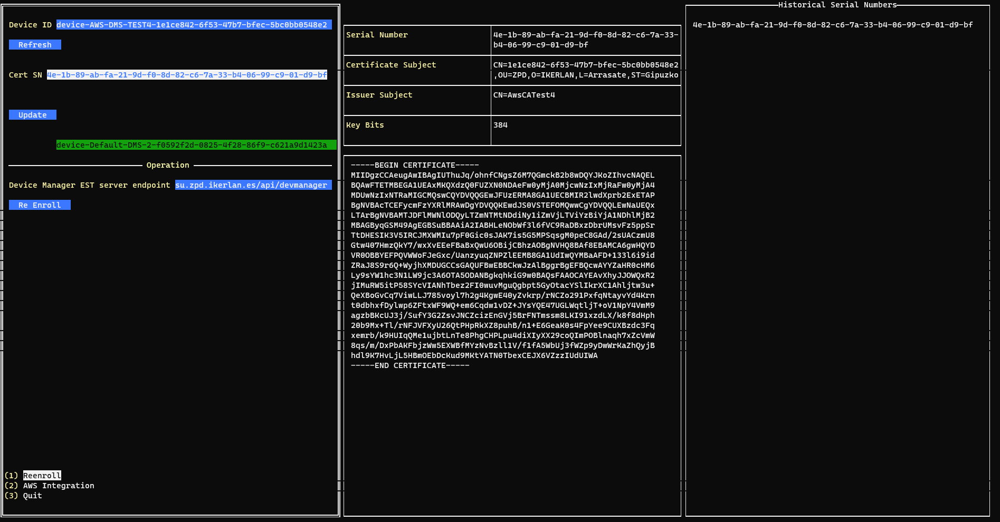
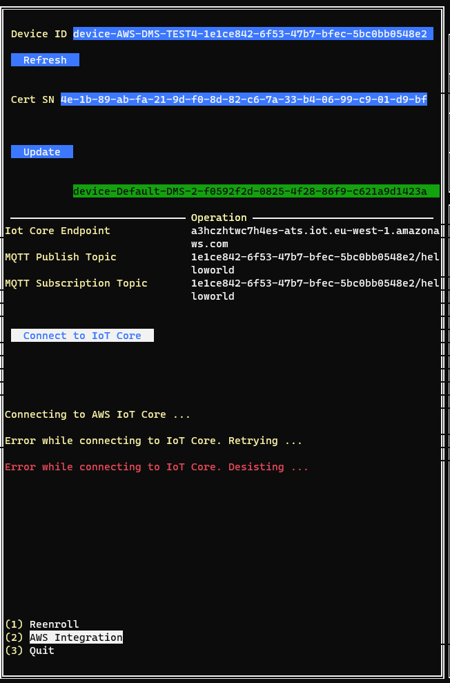

<a href="https://www.lamassu.io/">
    
</a>

Lamassu Virtual Device
=======
[](http://www.mozilla.org/MPL/2.0/index.txt)

[Lamassu](https://www.lamassu.io) project is a Public Key Infrastructure (PKI) for the Internet of Things (IoT).

To launch Lamassu-Virtual-Device follow the next steps:

1. Clone the repository and get into the directory: `https://github.com/lamassuiot/lamassu-virtual-device.git && cd lamassu-virtual-device`.
2. Change the configuration variables of the `config.json` file.

```
{
    "certificates_dir": "<DEVICES_CERTIFICATES>", // Folder where device certificates are stored
    "devmanager": {
        "est_server": "<DEVICE_MANAGER_SERVER>", // Device Manager Server Endpoint
        "cert":"<DEVMANAGER_CERT>" // Public certificate to connect to the device-manager
    },
    "aws":{
        "iot_core_ca_file": "<AWS_CA_CERT>", // AWS IoT Core CA Certificate
        "iot_core_endpoint": "<AWS_ENDPOINT>", // AWS IoT Core endpoint
        "test_lambda": "<LAMBDA>" // Lambda name
    }
}

```

3. `config.json` file with default values

```
{
    "certificates_dir": "/home/$USER/virtual-dms-data/devices_certificates",
    "devmanager": {
        "est_server": "dev.lamassu.io/api/devmanager",
        "cert":"<DEVMANAGER_CERT>"
    },
    "aws":{
        "iot_core_ca_file": "<AWS_CA_CERT>",
        "iot_core_endpoint": "<AWS_ENDPOINT>",
        "test_lambda": "<LAMBDA>"
    }
}

```

4. Run the Lamassu-Virtua-Device UI:
    ```
    go run cmd/main.go
    ```

## Lamassu Virtual device pages

Lamassu Virtual Device has the following pages:

- Device Information View: a page showing each device's information. Choose from the dropdown the DeviceId and the Serial Number of the Certificateof to visualize the details.



- AWS Integration: a page to check AWS connectivity



- Reenroll: each device has the option to reenroll


